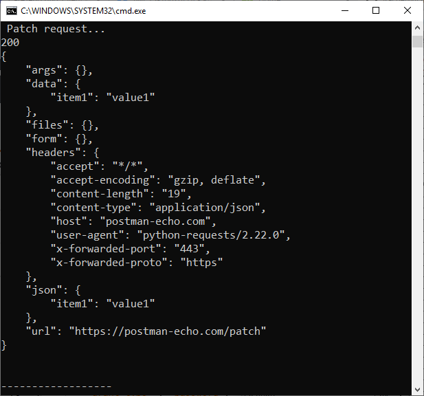

# Python-API-Requests
Example code to make API requests in Python using the requests library

## Dependencies:

* [urllib3](https://pypi.org/project/urllib3/)
* [requests](https://pypi.org/project/requests/)
* [idna](https://pypi.org/project/idna/)
* [chardet](https://pypi.org/project/chardet/)
* [certifi](https://pypi.org/project/certifi/)
